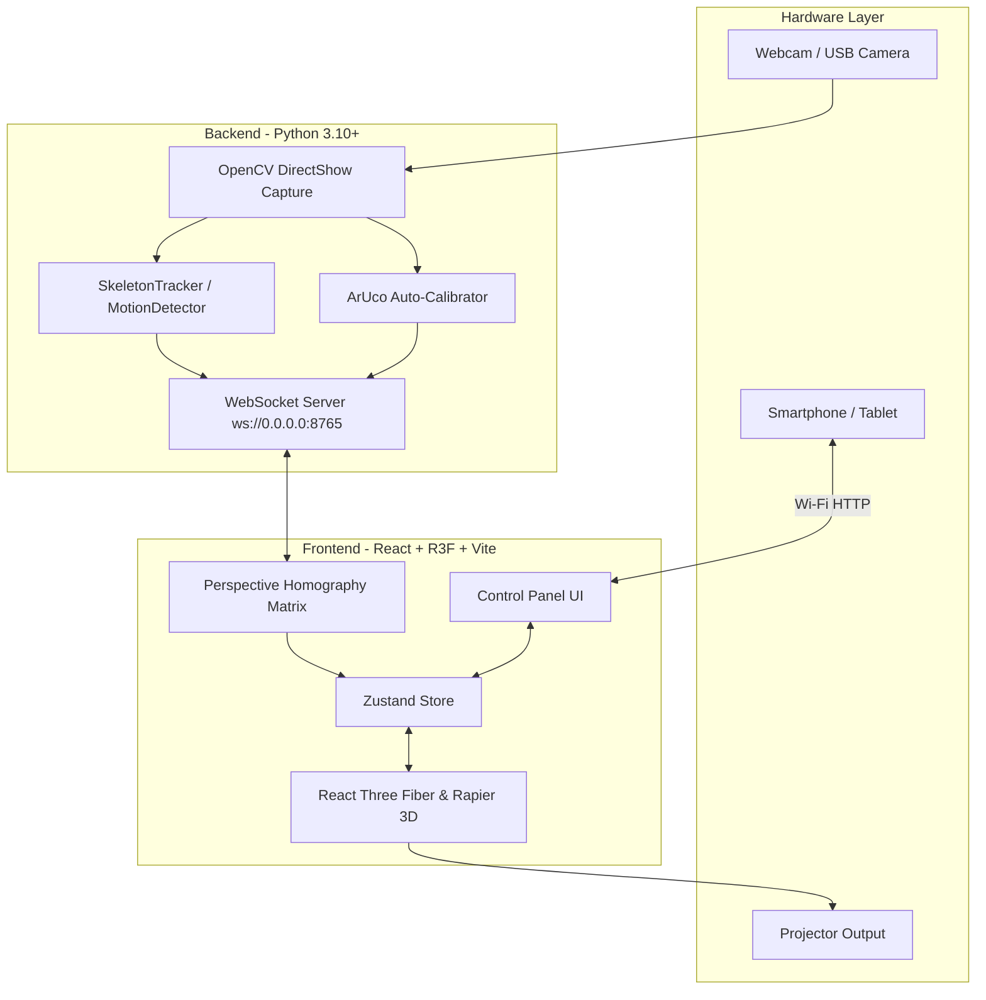

# 🌟 Vizualux — Interactive Projection & Computer Vision System

Vizualux is a high-performance, decoupled interactive projection installation framework. It combines real-time Computer Vision (MediaPipe Pose & OpenCV Frame Differencing) with 3D WebGL graphics (React Three Fiber & Rapier Physics) to transform any physical floor or wall into a dynamic, responsive digital canvas.

> [!TIP]
> 🌐 **Live Demo Available**: Explore the functional interactive web demo online at [vizualux.neocities.org](https://vizualux.neocities.org)!

---

## 🚀 Features & Highlights

### 🎯 Dual Computer Vision Tracking Engine
- **MediaPipe Pose Landmarker**: High-fidelity 3D skeleton tracking capturing hands, feet, and center-of-mass.
- **OpenCV Motion Detector**: High-speed frame-differencing blob detection that tracks motion vectors, area, and direction regardless of body shape (ideal for objects, animals, or multi-user interaction).
- **Runtime Mode Switcher**: Toggle between Pose and Motion detection instantly from the control interface.

### 🎨 8 Interactive Visual Modes

| Mode | Visual Theme | Mechanics & Interaction |
| :--- | :--- | :--- |
| 🪐 **Rigid Body Sandbox** | Space Asteroids | 3D Rapier rigid body physics. Hands and feet create physical colliders to push space debris. |
| 🌊 **Fluid Dynamics** | Liquid Shaders | Real-time GLSL fluid simulation. Left/right hands and feet create multi-colored wave disturbances. |
| 🐟 **Interactive Koi Pond** | Bioluminescent Aquatic | Boids AI school of Koi fish. Footsteps spawn water ripples; hands drop breadcrumbs to feed; stepping startles fish away. |
| 🌲 **Forest Motion Reveal** | Lush Mossy Floor | Offscreen 2D canvas alpha mask. Walking over the dark void reveals a photorealistic forest floor that slowly dissolves back to dark. |
| 🍁 **Leaf Scatter** | Autumn Leaves | 2D/3D maple leaf physics. Leaves drift on drag friction and spin/scatter away when kicked. |
| ✨ **Twinkling Sparkles** | Cosmic Flares | Velocity-triggered starburst particles that float upward, twinkle via sine scaling, and fade. |
| 🌈 **Particle Trail** | Rainbow Flow | Continuous HSL hue-cycling particle streams following fast-moving hands and feet. |
| 🏖️ **Sandy Shore Ripples** | Beach Coastline | Photorealistic wet sand under shallow water. Stepping generates water rings and kicks 3D procedural seashells. |

### 🛠️ Hardware & Calibration Tools
- **Dual-Display Architecture**: Separate **Control Panel** (operator interface) and **Projector View** (fullscreen output) synced in real-time via `BroadcastChannel` and WebSockets.
- **ArUco Auto-Calibration**: Project 4 ArUco markers (IDs 0–3) at the screen corners for one-click automated perspective homography alignment using OpenCV.
- **Manual Homography Dragging**: Intuitive 4-corner handle adjustment on camera preview for fine tuning.
- **Background Clutter Rejection**: Automatic zone clipping that discards tracking data outside the calibrated projection rectangle.
- **UI Confidence Sliders**: Real-time adjustments for Detection, Presence, and Tracking confidence thresholds.
- **Multi-Surface Compatibility**: Seamless support for both **Floor** (foot-driven) and **Wall** (hand-driven) installations.
- **Camera Auto-Discovery & Fallback**: Automatically discovers camera device names via DirectShow and falls back to Media Foundation (`MSMF`) if standard capture fails.
- **Local Network Remote Control**: Access the Control Panel from any smartphone or tablet on the local Wi-Fi.

---

## 🏗️ System Architecture



---

## 📋 Prerequisites & Installation

### Hardware Requirements
- **Host Computer**: Windows 10/11 (Intel i5/Ryzen 5+, 8GB RAM, Dedicated GPU recommended)
- **Camera**: USB Webcam (720p @ 60fps recommended) mounted above the floor or in front of the wall
- **Projector**: Any HD projector (1080p recommended)

### Software Requirements
- **Python**: 3.10 or higher
- **Node.js**: 18.0 or higher
- **Git**

---

## ⚡ Quick Start

### One-Click Launch (Windows)
Double-click `start_installation.bat` in the root folder. It will launch both the Python tracking backend and Vite frontend server in separate command windows.

### Manual Launch

#### 1. Start Python Tracking Backend
```bash
cd backend
python -m venv .venv
# Activate environment (Windows PowerShell: .venv\Scripts\Activate.ps1)
pip install -r requirements.txt
python main.py
```

#### 2. Start Vite Frontend Web App
```bash
cd frontend
npm install
npm run dev
```

---

## 🎯 Calibration Guide

1. Open the Control Panel on your laptop at `http://localhost:5173`.
2. Click **Launch Projector Window** and drag the new window to your projector display (press `Double-Click` or `F11` for Fullscreen).
3. Click **Calibrate Tracking** on the Control Panel.
4. **Option A (Automated)**: Point your camera at the projector screen and click **⟳ Auto Calibrate**. OpenCV will detect the 4 ArUco markers and snap the calibration handles into place.
5. **Option B (Manual)**: Drag the 4 corner handles on the camera preview so they line up with the 4 color boxes projected on your surface.
6. Click **Save & Exit Calibration**. Your calibration settings are saved to `localStorage` automatically.

---

## 📱 Remote Control Setup (Mobile / Tablet)

To control the installation from your smartphone or tablet while walking around the space:
1. Ensure your mobile device is connected to the **same Wi-Fi network** as the host PC.
2. Open Command Prompt on the PC and find your local IP address: `ipconfig` (look for `IPv4 Address`, e.g., `192.168.1.45`).
3. Open a browser on your mobile device and navigate to:
   ```text
   http://192.168.1.45:5173
   ```
4. You can now change modes, tweak thresholds, or calibrate directly from your phone!

---

## 📂 Project Structure

```text
vizualux/
├── backend/
│   ├── main.py                  # Main asyncio WebSocket server & capture loop
│   ├── tracker.py               # MediaPipe Pose Task landmarker wrapper
│   ├── motion_detector.py       # OpenCV frame-differencing blob tracker
│   ├── requirements.txt         # Python dependencies (opencv, mediapipe, pygrabber, websockets)
│   └── pose_landmarker_full.task# MediaPipe full pose model binary
├── frontend/
│   ├── src/
│   │   ├── components/
│   │   │   ├── modes/           # 8 interactive R3F visual modes
│   │   │   │   ├── Asteroids.tsx
│   │   │   │   ├── FluidSimulation.tsx
│   │   │   │   ├── KoiPond.tsx
│   │   │   │   ├── MotionReveal.tsx
│   │   │   │   ├── ScatterLeaves.tsx
│   │   │   │   ├── Sparkles.tsx
│   │   │   │   ├── ParticleTrail.tsx
│   │   │   │   └── SandyShore.tsx
│   │   │   ├── UI/
│   │   │   │   ├── ControlPanel.tsx   # Operator controls & threshold sliders
│   │   │   │   └── CalibrationUI.tsx  # Perspective alignment interface
│   │   │   ├── KinematicColliders.tsx # 3D Rapier physical colliders for hands/feet
│   │   │   └── Scene.tsx             # Main R3F Canvas & mode router
│   │   ├── hooks/
│   │   │   └── useTracker.ts    # WebSocket client & homography zone-clipping matrix
│   │   ├── store/
│   │   │   └── useStore.ts      # Zustand state manager & BroadcastChannel sync
│   │   └── App.tsx              # View router (Control Panel vs Projector)
│   ├── public/
│   │   ├── aruco/               # Generated ArUco calibration marker images
│   │   └── textures/            # Forest floor, leaf, sparkle, & sand textures
│   └── vite.config.ts           # Vite configuration with host exposure
├── start_installation.bat      # One-click Windows startup script
└── README.md
```

---

## 📄 License

Distributed under the MIT License. See `LICENSE` for more information.
